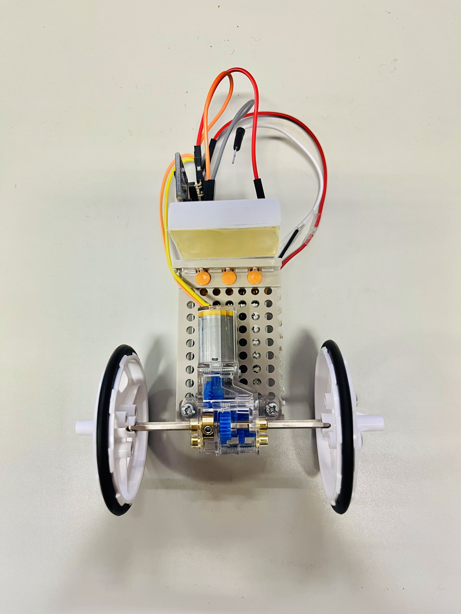
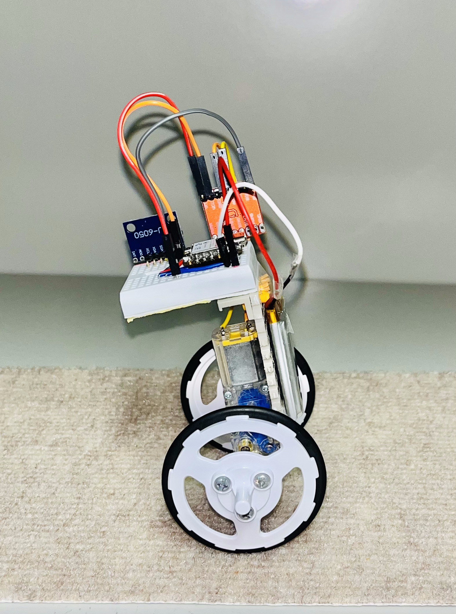

# robbit_project(Two-wheeled self-balancing robot project)

**robbit_project**は、マイコンまたはFPGAを活用する扱いやすいtwo-wheeled self-balancing robot(TW-SBR)を作成するプロジェクトである。

FPGAを活用するTW-SBRは**robbit**、マイコンを活用するTW-SBRは**robbit-esp**と呼ばれる。

## robbit

**robbit**はFPGAを活用する扱いやすいtwo-wheeled self-balancinig robot(TW-SBR)である。

**robbit**は[CFU Proving Ground](https://github.com/archlab-sciencetokyo/CFU-Proving-Ground)と呼ばれるオープンソースを利用することで、開発しやすいロボットになっている。

**robbit**の組み立て費用も2万円弱になっているので、既存のFPGAを利用するSelf-balancing robotの開発キットよりも安価になっている。

### robbitの構成

FPGAに実装するSoCはすべてVerilog HDLで実装されている。

**robbit**の動作制御はPID制御で行っており、これはソフトウェアで実装されている。
ソフトウェアはRISC-Vプロセッサで動作する。

このため、開発者は**robbit**の開発を通じて、ロボットの組み立てやRTL設計を通したハードウェア開発だけでなく、PID制御による動作改善を通したソフトウェア開発も学ぶことができる

### 📁 robbit プロジェクト構造

**robbit**の開発を行う場合は[robbitフォルダ](./robbit/)内を参照してほしい。
また、robbitフォルダ内には、[開発マニュアル](./robbit/setting/manual/robbit_manual.pdf)や
[システムマニュアル](./robbit/setting/manual/robbit_system_manual.pdf)があるので、そちらを参考にして開発を進めてほしい。

    .
    └── robbit_project/
        └── robbit/   <----------------- 参照フォルダ
            ├── CFU-Proving-Ground/
            └── setting/
               ├── image
                ├── manual
                └── merge_file

<table>
    <tr>
        <td></td>
        <td></td>
</table>

## robbti-esp

**robbit**とは別に、**robbit-esp**と呼ばれる、ESP32-C3で制御するロボットも開発できる。

**robbit-esp**の構成は、できるだけ**robbit**と同じ仕様にしている。
**robbit-esp**はBLE通信によるリアルタイムのパラメータ通信を可能にしているため、ディスプレイを接続していない。

**robbit-esp**を開発することで、マイコン開発を学べるだけでなく、**robbit**との動作比較も行える。

**robbit-esp**の開発を行う場合は[robbit-espフォルダ](./robbit-esp/)内を参照してほしい。

### 📁 robbit プロジェクト構造
robbit-espフォルダ内には[開発マニュアル](./robbit-esp/manual/robbit-esp_manual.pdf)と
[システムマニュアル](./robbit-esp/manual/robbit-esp_system_manual.pdf)が存在するので、これらを参考に開発を進めてほしい。

    .
    └── robbit_project/
        └── robbit-esp/  <----------------- 参照フォルダ
            ├── image
            └── manual

<table>
    <tr>
        <td></td>
        <td></td>
</table>

<!-- ## 📁 プロジェクト構造

本リポジトリの構成は以下の通りである。

    .
    └── robbit_project/
        ├── robbit-esp/
        │   ├── image
        │   └── manual
        └── robbit/
            ├── CFU-Proving-Ground/
            └── setting/
               ├── image
                ├── manual
                └── merge_file

robbit-espフォルダには、robbit-espを開発するのに必要なプログラムやマニュアルが用意されている。

robbitフォルダには、robbitを開発するのに必要なプログラムやマニュアルが用意されている。

**robbit**を開発する場合はrobbitフォルダで、**robbit-esp**を開発する場合にはrobbit-espフォルダで作業を行う。
開発するロボットのフォルダにあるREADMEやマニュアルを参考にすると、開発しやすくなるだろう。 -->

## ライセンスに注意が必要なライブラリ

- MadgwickAHRS ライブラリ
    - 提供元：Arduino LLC
    - 使用箇所：
        - robbit/setting/merge_file/main.cpp（コードの一部を統合）
        - robbit-esp/robbit-esp.ino（#include <MadgwickAHRS.h>）
    - ライセンス：GNU Lesser General Public License v2.1 or later
    - ライセンス全文は本リポジトリに同梱（COPYING.LESSER）されています。
    - ※このライブラリを使用しているコードの再利用・再配布時には、LGPLの条件にご注意ください。

## 更新履歴

### 2025/10/24

- robbit, robbit-espのversion 1.0を公開
