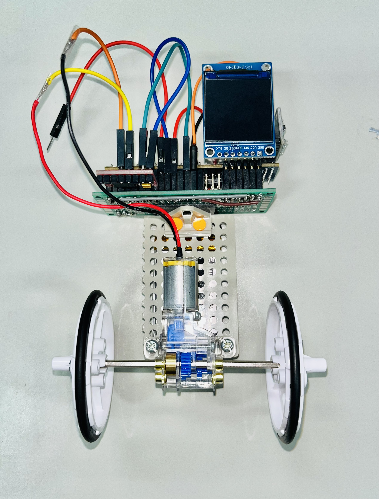
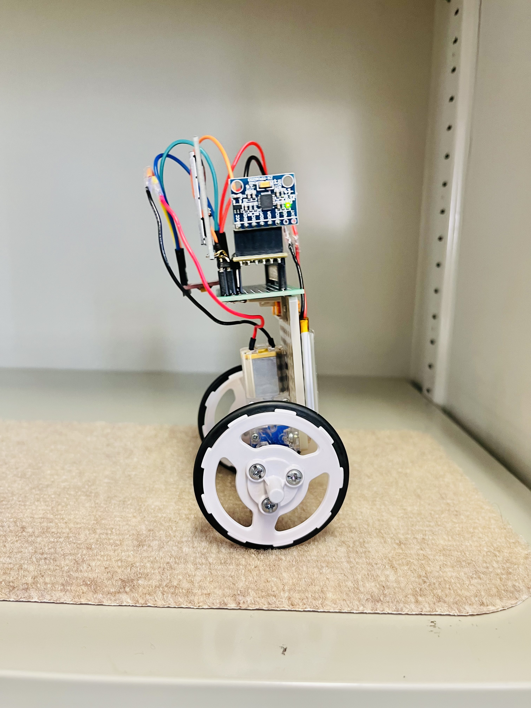
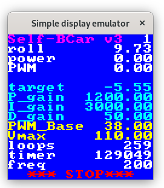
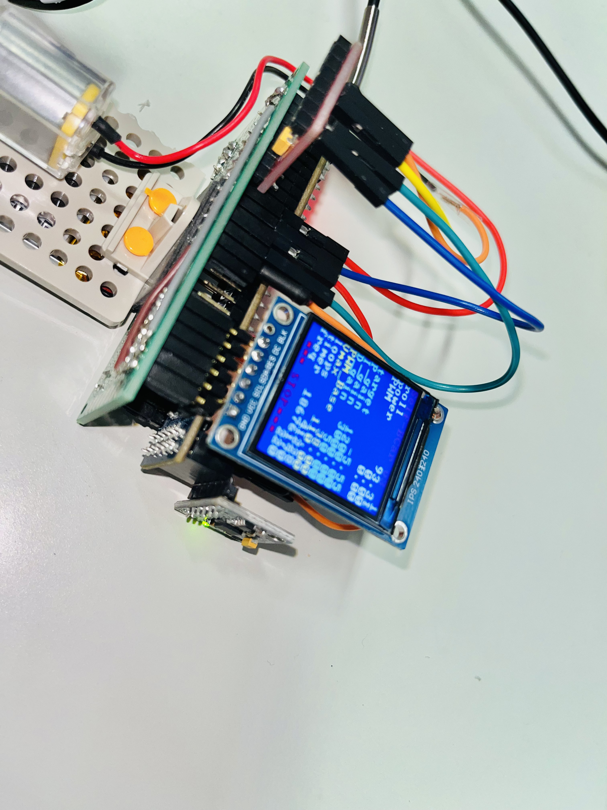

# robbit

**robbit** is an easy-to-use, two-wheeled self-balancing robot that utilizes an FPGA.
It is developed using the **Cmod A7-35T** FPGA and an open-source development environment called **CFU-Proving-Ground**.   

For more details on CFU-Proving-Ground, please see:
[archlab-science-tokyo/CFU-Proving-Ground](https://github.com/archlab-sciencetokyo/CFU-Proving-Ground)

The recommended OS is **Ubuntu Linux**.
This project works with **Vivado 2024.1**.

Please follow the development procedure below.

<table>
    <tr>
        <td></td>
        <td></td>
</table>

-----

## Chap. 1 Purchase of Parts

Table 1 shows the parts required to build **robbit**.

| Part | Name | Quantity |
| --- | ----- | --- |
| FPGA | Cmod A7-35T | 1 |
| Sensor | MPU-6050 | 1 |
| Motor | Mini Motor Standard Gearbox 70188 | 1 |
| Tires | Slim Tire Set (55mm Dia.) 70193| 1 |
| Motor Driver | TB6612FNG | 1 |
| Battery | EEMB Lithium-Ion Battery 653042 | 1 |
| Display | 240×240 Display with ST7789 IC | 1 |
| Plate | Universal Plate Set 70157 | 1 |

-----

## Chap. 2 Assembling the Robot

Please see the manual below for information on assembling the **robbit**.

[setting/manual/mannual_robit](setting/manual/mannual_robbit.pdf)

-----

## Chap. 3 Environment Setup

### Chap. 3.1 Clone the robbit repository 

Clone the robbit repository into the same directory as CFU-Proving-Ground using the following command:

```bash
git clone git@github.com:archlab-sciencetokyo/robbit.git
```
### Chap. 3.2 Setting up CFU-Proving-Ground

CFU-Proving-Ground has been added as a sub-module in the child repository.
It must be built with the following command.

```bash
git submodule update --init --recursive 
```

Please refer to [archlab-science-tokyo/CFU-Proving-Ground](https://github.com/archlab-sciencetokyo/CFU-Proving-Ground), complete the CFU-Proving-Ground set-up.

The following instructions assume that **CFU-Proving-Ground is ready to use**.
This may take some time as it involves setting up the RISC-V compiler.

### Chap. 3.3 Integrating with the robbit Environment

Please, integrate the robbit repository with the CFU-Proving-Ground repository using the following commands:

```bash
cd robbit
make init
```

If you want to revert this repository to its pre-integration state, enter the following command

```bash
make reset 
```

-----

## Chap. 4 Simulation and Bitstream Generation

Compile the program with the following command:

```bash
make
```

robbit allows you to view real-time information, such as parameters, on its display. You can also check the display output in a simulation using the following command:

```bash
make drun
```

When this command is executed, the following simulation results are output



When you are ready to program the FPGA, you need to generate a bitstream. Generate it with the following command:

```bash
make bit
```

-----

## Chap. 5 Parameter tuning

Of course. Here is the English translation in Markdown format.

-----

The **robbit** allows for real-time parameter tuning using the buttons connected to the Cmod A7-35T.
Pressing Button 1 decreases the parameter's value, and pressing Button 0 increases it.
Pressing both buttons at the same time changes the selected parameter.

The parameters are shown on the display, so you can check the values as you change them.

<table>
    <tr>
        <td></td>
        <td>
    </tr>
</table>

The number displayed to the right of **Self-Bcar v3** indicates the number of the parameter being controlled.
The adjustable parameters shown on the display and their corresponding numbers are as follows:

| Parameter | Parameter Number | Explanation |
| --------- | :--------------: | ----------- |
| target    |        1         | Target angle |
| P\_gain    |        2         | Proportional gain |
| I\_gain    |        3         | Integral gain |
| D\_gain    |        4         | Derivative gain |
| PWM\_Base  |        5         | Minimum PWM signal value (motor's minimum speed) |
| V\_max     |        6         | Maximum PWM signal value (motor's maximum speed) |

-----

The meanings of the other numerical values are as follows:

| Parameter | Explanation |
| --------- | ----------- |
| roll      | Body angle of the robbit |
| power     | Result of the PID control calculation |
| PWM       | PWM control signal |
| loops     | Angle calculation count |
| timer     | Elapsed time since power-on |
| freq      | Frequency of the software's while loop |

## History
