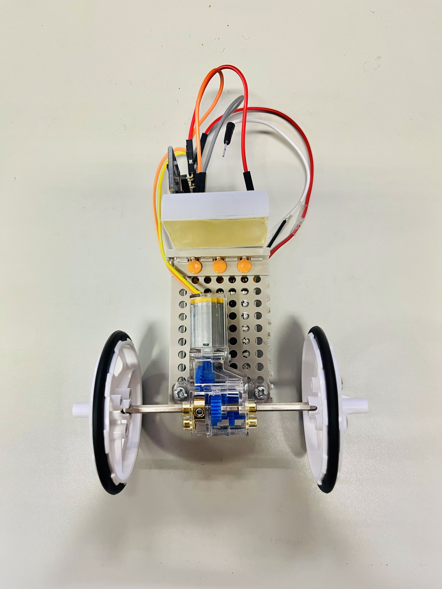

# robbit-ESP
 
robbit-ESPはESP32-C3で制御する扱いやすいtwo-wheeled self-balancing robotである。

robbit-ESPは部品の総額が安く，無線によるリアルタイムのパラメータチューニングが可能であるため開発が容易である。

<table>
    <tr>
        <td></td>
        <td></td>
</table>

-----

## Chap. 1 部品購入

以下の表は **robbit(ESP32-C3モデル)** 組み立てに必要な部品である。
 
記載されている部品をそろえる。

| Part | Name | Quantity |
| --- | ----- | --- |
| microcontroller | XIAO ESP32-C3 | 1 |
| Sensor | MPU-6050 | 1 |
| Motor | Mini Motor Standard Gearbox 70188 | 1 |
| Tires | Slim Tire Set (55mm Dia.) 70193| 1 |
| Motor Driver | TB6612FNG | 1 |
| Battery | EEMB Lithium-Ion Battery 653042 | 1 |
| Plate | Universal Plate Set 70157 | 1 |

-----

## Chap. 2 robbit-ESPの組み立て

### Step. 1 robbitの部品確認

Chap. 1に示されている部品がすべてそろっていることを確認する。

### Step. 2 robbitのシャーシ作成

まずはバッテリーと充電モジュールに導線を下図のようにはんだ付けする。
はんだ付けをした後は、バッテリーを充電モジュールと接続し充電する。
充電モジュールはバッテリーの充電が不十分だと赤色にLEDを点灯させ、充電が完了すると青色にLEDを点灯させる。

<table>
    <tr>
    <td></td>
    <td>
</table>

次にユニバーサルプレートを切断する。
ユニバーサルプレートの大きさはこの後制作する制御モジュールの大きさに合わせるとよい。
また、下図のように制御モジュールを接着する部分を用意しておく。

<table>
    <tr>
    <td></td>
    <td>
</table>

TAMIYAのMini Motor Standard Gearbox 70188とSlim Tire Set (55mm Dia.) 70193を作成する。

TAMIYAのMini Motor Standard Gearbox 70188の[組み立てマニュアル](./image/tamiya__gearbox_mannual.pdf)を参考にしてほしい。
組み立てに必要な部品や作業は黄色で色付けしてある。
モータが完成したら、バッテリーと接続し問題なく回転するか確認する。

最後に，ユニバーサルプレートにバッテリーとモータを取り付けるとシャーシが完成する。

<table>
    <tr>
    <td></td>
    <td>
</table>

### Step. 3 制御モジュールの作成

モータドライバのVM, VCC, GND, AO1, A02にヘッダピンをはんだ付けをする

同様にIMUモジュールにピンヘッダをはんだ付けする。
IMUモジュールはVCC, GND, SCL, SDAをつなげば動作するが，安定性向上のためPmodの接続部分にはすべてヘッダピンをはんだ付けする。

ブレットボードまたは、ユニバーサル基盤を用意する。

用意したブレットボードまたは基盤に回路図を参考に配線、はんだ付けをする。

### Step. 4 robbitの組み立て

シャーシと制御モジュールを取り付け，バッテリーとモータを配線するとrobbitが完成する。

-----

## Chap. 3 環境構築と書き込み

### Step. 1 Arudino IDEのダウンロード

ESP32-C3の書き込みには，Arduino IDEを使用する．

Arudino IDEをインストールしていない場合は，[ダウンロードページ](https://www.arduino.cc/en/software/)からダウンロードする．

インストールが完了したら，リポジトリにある**robbit-esp.ino**を開いて，Step. 2に進む．

### Step. 2 書き込み準備

まずは，ESP32-C3ボードを使えるように設定する．

1. `File` -> `Preference` -> `Setting` -> `Additional boards manager URLs`に以下のURLを設定する

    https://raw.githubusercontent.com/espressif/arduino-esp32/gh-pages/package_esp32_index.json

2. `Tools` -> `Board` -> `Board Manager`でBoard Managerを開き `esp32 by Espressif Systems`をダウンロードする
3. `Tools` -> `Board` -> `esp32` -> `XIAO_ESP32C3` を選択する
4. `Tools` -> `Port` でESP32-C3に対応するポート番号を設定する

以上でボードの設定は全てである．

次に，必要なライブラリをインストールする．

`Tools` -> `Manage libraries`でライブライマネージャーを開ける．

ライブラリマネージャで以下のライブラリをインストールする

- MPU6050 by Electric Cats
- Madgwick by Arduino
- BluetoothSerial by Henry Abrahamsen

Madgwickフィルタのライブラリ内にMadgwickAHRS.hというヘッダーファイルがあるので以下の関数を追加する

    void setGain(float gain) { beta = gain; }

ライブラリの設定は以上である．

### Step .3 書き込み

書き込む前に，以下のことを確認する。
- PCとESP32-Cが接続する
- `Tools` -> `Port` でESP32-C3に対応するポート番号を設定する
- `Tools` -> `Board` -> `esp32` -> `XIAO_ESP32C3` を選択する

上記の内容をすべて確認出来たら画面左上のUploadマークを押すとコンパイルが行われた後、書き込みが行われる。

画面下のターミナルに以下のように出力されたら書き込みは成功になる。

## Chap. 4 動作確認

書き込みが終了したら、PCとESP32-C3の接続を解除し、robbitの電源を入れて動作を確認する。

動作確認はカーペットのようなある程度摩擦が生じる環境で行うと良い。

摩擦のない環境だと、その場で自立することが難しくなる。

## Chap. 5 パラメータチューニング

robbitのESP32-C3モデルはPCとのBLE通信によりパラメータチューニングを行える。
以下にパラメータチューニングの手順を示す。

### Step. 1 PCの環境構築

パラメータチューニングを行うにはpythonライブラリのbleakを使用する。
そのため、robbitとBLE通信を行うPC内にpythonの仮想環境を作成し、下記のコマンドでbleakをインストールする。

    pip install bleak

### Step. 2 robbitとのBLE接続

robbitを起動し、少し待ってからble_connect.pyを実行する。

実行すると、robbitとPCの無線での接続が行われる。
接続に成功するとターミナルに下記の出力が表示される。
この画面では，robbitに搭載するESp32-C3のサービスUUID(Service_uuid)、MACアドレス(MAC_adress)、Characteristic_uuidを表示している。
Service_uuidとCharacteristic_uuidはinoファイルの冒頭で定義している値になっているはずである。

この状態になると、パラメータチューニングが可能になる。

### Step. 3 パラメータチューニング

パラメータの変更は`input ("parameter number" "value") -> `の後に以下のような形式で入力すると実行される。

    "パラメータ番号"␣"値"

    ただし、␣は半角スペース

パラメータ番号とは、変更可能なパラメータに割り振られている一連の番号である。対応表を以下に示す。

| パラメータ | パラメータ番号 | 説明 |
| --------- | :--------------: | ----------- |
| target    |        1         | 車体の目標角度 |
| P\_gain    |        2         | 比例要素のゲイン |
| I\_gain    |        3         | 積分要素のゲイン |
| D\_gain    |        4         | 微分要素のゲイン |
| PWM\_Base  |        5         | PWM信号の増加値 |
| V\_max     |        6         | PWM信号の最大値 |

パラメータの変更が成功すると以下のように変更結果が出力される。

下記の画像では`6 200`と入力しているため、パラメータ番号が6のV_MAXが200に変わっている。

以上の手順でパラメータチューニングを行うことができる。

現状のパラメータを確認したい場合は、`input ("parameter number" "value") -> `に`r`を入力すると確認できる。

robbitとのBLE接続を解除したい場合には，`input ("parameter number" "value") -> `に`e`を入力すると確認できる。

## History
