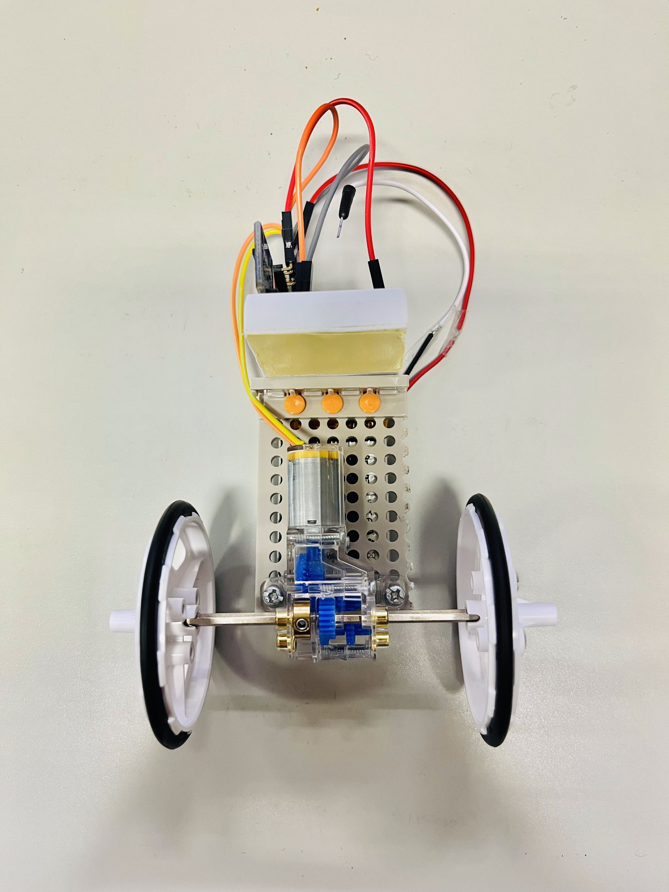
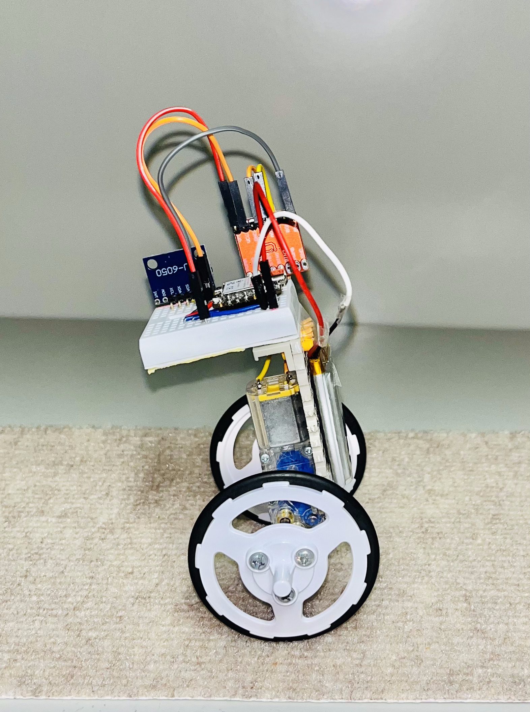

# robbit-esp

[日本語版はこちら / Read this document in Japanese](./README_ja.md)

**robbit-esp** is an accessible two-wheeled self-balancing robot controlled by
an ESP32-C3.

Its low total component cost and support for real-time wireless parameter
tuning make it easy to develop. Through robbit-esp development, users can
learn about microcontroller development and robot control.

<table>
    <tr>
        <td></td>
        <td></td>
    </tr>
</table>

---

## Components

The following components are used to assemble robbit-esp. Prices are as of
August 2025 and are listed in Japanese yen.

| Vendor | Product | URL | Total | Quantity | Unit Price |
|:---|:---|:---|---:|---:|---:|
| Switch Science | Seeed Studio XIAO ESP32C3 | <https://www.switch-science.com/products/8348> | 1,069 | 1 | 1,069 |
| Amazon | MPU-6050 3-axis accelerometer and gyroscope module | <https://www.amazon.co.jp/gp/product/B0DL5D5V4B/> | 1,949 | 6 | 325 |
| Amazon | Tamiya Educational Construction Series No. 188 Mini Motor Multi-Ratio Gearbox (8-Speed), 70188 | <https://www.amazon.co.jp/gp/product/B002R0DQCK/> | 632 | 1 | 632 |
| Amazon | Tamiya Educational Construction Series No. 193 Slim Tire Set (36/55 mm Diameter), 70193 | <https://www.amazon.co.jp/gp/product/B003YORNNG/> | 528 | 1 | 528 |
| Amazon | Tamiya Educational Construction Series No. 157 Universal Plate Set (2 Pieces), 70157 | <https://www.amazon.co.jp/dp/B001VZHRXG/> | 660 | 4 | 165 |
| Amazon | TB6612FNG Dual DC Motor Driver Module | <https://www.amazon.co.jp/dp/B0F2949HQR/> | 998 | 3 | 333 |
| Amazon | EEMB 3.7 V 820 mAh Rechargeable Lithium-Ion Battery, 653042 | <https://www.amazon.co.jp/gp/product/B08D6B3PC4/> | 2,499 | 4 | 625 |
| Amazon | TP4056 USB Type-C Lithium Battery Charger Module | <https://www.amazon.co.jp/dp/B0C8HNLM29/> | 525 | 3 | 175 |

## Development Workflow

The intended robbit-esp development workflow is:

1. Assemble robbit-esp.
2. Build and upload the firmware.
3. Verify its operation.
4. Tune the parameters.

When developing robbit-esp using this workflow, refer to
[**robbit-esp_manual.pdf**](./manual/robbit-esp_manual.pdf) and
[**robbit-esp_system_manual.pdf**](./manual/robbit-esp_system_manual.pdf) in
the `manual` directory.

We recommend starting with the assembly and operation-verification procedures
in **robbit-esp_manual.pdf**. After verifying that the robot operates
correctly, use **robbit-esp_system_manual.pdf** as a reference while improving
its performance.

- [robbit-esp_manual.pdf](./manual/robbit-esp_manual.pdf): Assembly and
  development procedures for robbit-esp
- [robbit-esp_system_manual.pdf](./manual/robbit-esp_system_manual.pdf):
  Control methods implemented in robbit-esp

## Version History

### Version 1.0

- October 31, 2025: Released version 1.0
