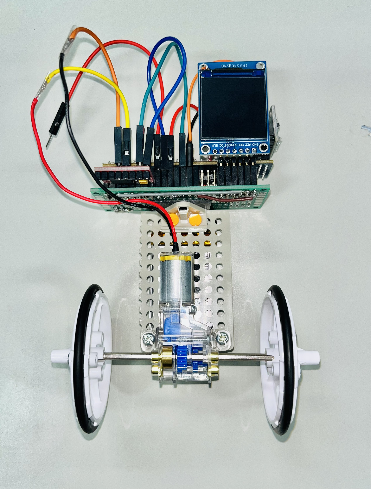

# robbit

**robbit**はFPGAを活用する扱いやすいtwo wheel self-balancing robotである。

これは、**CFU Proving Ground**というオープンソースの開発環境と**Cmod A7-35T** FPGAボードを使用して開発されている。  

**CFU Proving Ground**の詳細は
[archlab-science-tokyo/CFU-Proving-Ground](https://github.com/archlab-sciencetokyo/CFU-Proving-Ground)
を参照してほしい。

- 推奨OS: **Ubuntu Linux**.
-  **Vivado 2024.1**.

<table>
    <tr>
        <td></td>
        <td></td>
</table>

-----

## 構成部品

robbitの組み立てには以下の部品を使用する。価格は2025年8月時点の価格である。

| 購入先 | 品名 | URL | 合計 | 数量 | 単価 |
|:---|:---|:---|:---|:---|:---|
| RS | FPGA Cmod A7 Artix-7 |  https://jp.rs-online.com/web/p/fpga-development-tools/1346483?srsltid=AfmBOoo4WPbP23WIyYoDyq6-E5PDHWm1VNSNc6kzXF4a5DtnkcVwOpOFWcQ | 15733 | 1 | 15733 |
| Amazon | MPU-6050 3軸加速度計・ジャイロモジュール MPU-6050 | https://www.amazon.co.jp/gp/product/B0DL5D5V4B/ | 1949 | 6 | 325 |
| Amazon | タミヤ 楽しい工作シリーズ No.188 ミニモーター標準ギヤボックス 8速 70188 | https://www.amazon.co.jp/gp/product/B002R0DQCK/　| 632 | 1 | 632 |
| Amazon | タミヤ 楽しい工作シリーズ No.193 スリムタイヤセット (36・55mm径) 70193　| https://www.amazon.co.jp/gp/product/B003YORNNG/ | 528 | 1 | 528 |
| Amazon | タミヤ 楽しい工作シリーズ No.157 ユニバーサルプレート 2枚セット (70157) | https://www.amazon.co.jp/dp/B001VZHRXG/ | 660 | 4 | 165 |
| Amazon | tb6612fngデュアルdcステッピングモータドライバモジュール | https://www.amazon.co.jp/dp/B0F2949HQR/ | 998 | 3 | 333 |
| Amazon | SpiインターフェースフルカラーTft Lcdディスプレイ | https://www.amazon.co.jp/dp/B0F2HLG88G/ | 1999 | 2 | 1000 |
| Amazon | EEMB 3.7V 充電式 リチウムイオン電池 653042 820mAh | https://www.amazon.co.jp/gp/product/B08D6B3PC4/ | 2499 | 4 | 625 |
| Amazon | TP4056 Type-C USB リチウム電池充電器モジュール | https://www.amazon.co.jp/dp/B0C8HNLM29/ | 525 | 3 | 175 |

## 開発方法

robbitの開発は以下の手順を想定している

1. robbit-espの組み立て
2. プログラム書き込み(Bitstream, バイナリ生成, コンフィギュレーション)
3. 動作確認
4. パラメータチューニング

上記の手順でrobbitの開発を行う際は，./setting/manualフォルダ内にある[**robbit_manual.pdf**](./setting/manual/robbit_manual.pdf)と
[**robbit_system_manual.pdf**](./setting/manual/robbit_system_manual.pdf)を参考にする。

まずは，**robbit_manual.pdf**に記載されている手順に沿ってrobbitの組み立てと動作確認を行うと良い。

動作確認まで終えることができたら，**robbit_system.pdf**も参考にしながら，パラメータチューニングに取り組むことをお勧めする。

- [robbit_manual.pdf](./setting/manual/robbit_manual.pdf) : robbitの組み立て手順と開発手順が示されている
- [robbit_system_manual.pdf](./setting/manual/robbit_system_manual.pdf) : robbitに実装されている制御手法が示されている

## メモリーマップ

| addr   |  description                     |
| -----------| -----------------------------|
| 0x00000000 - 0x00007FFF | 32KiB Instruction Memory     |
| 0x10000000 - 0x10003FFF | 16KiB Data Memory            |
| 0x20000000 - 0x2000FFFF | 64KiB Video Memory    |
| 0x30000000 - 0x30000009 | acceleration，angular velocity |
| 0x30000010 | 100MHz Timer Clock |
| 0x30000040-0x3000044 | PWM signal, two buttons detection |
| 0x40000000 | performance counter control (0: reset, 1: start, 2: stop)|
| 0x40000004 | mcycle                  |
| 0x40000008 | mcycleh                 |
| 0x80000000 | tohost (for simulation) |

## バージョン履歴

### version 1.0

- 2025/10/01: version 1.0 公開
