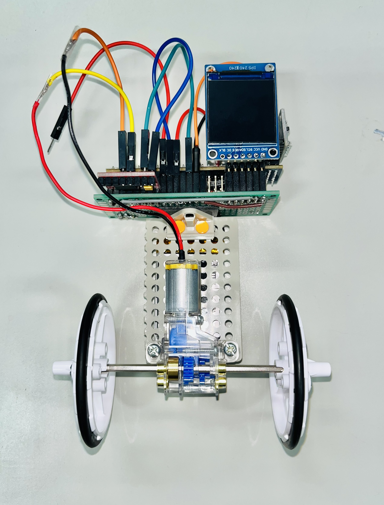
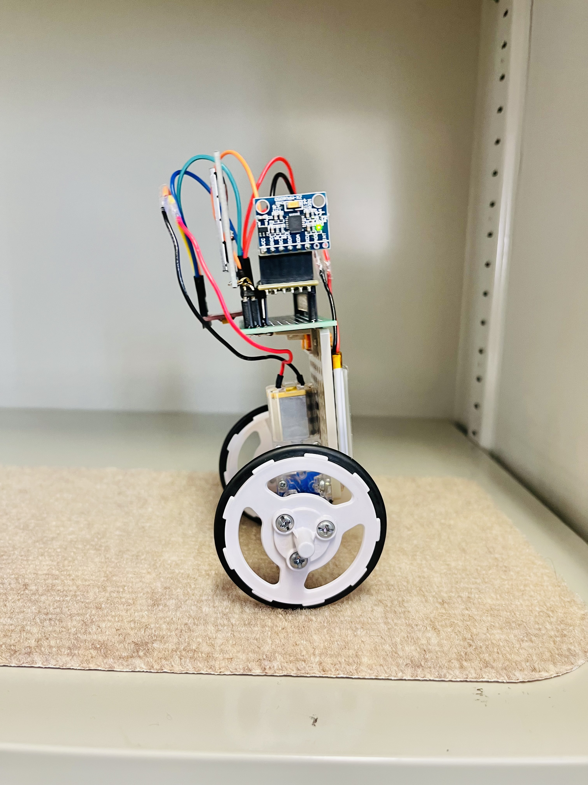

# robbit

[日本語版はこちら / Read this document in Japanese](./README_ja.md)

**robbit** is an accessible two-wheeled self-balancing robot that uses an
FPGA.

It is developed using the open-source **CFU Proving Ground** development
environment and a **Cmod A7-35T** FPGA board.

For details about **CFU Proving Ground**, see
[archlab-science-tokyo/CFU-Proving-Ground](https://github.com/archlab-sciencetokyo/CFU-Proving-Ground).

- Recommended OS: **Ubuntu Linux**
- FPGA development tool: **Vivado 2024.1**

<table>
    <tr>
        <td></td>
        <td></td>
    </tr>
</table>

---

## Components

The following components are used to assemble robbit. Prices are as of August
2025 and are listed in Japanese yen.

| Vendor | Product | URL | Total | Quantity | Unit Price |
|:---|:---|:---|---:|---:|---:|
| RS | FPGA Cmod A7 Artix-7 | <https://jp.rs-online.com/web/p/fpga-development-tools/1346483?srsltid=AfmBOoo4WPbP23WIyYoDyq6-E5PDHWm1VNSNc6kzXF4a5DtnkcVwOpOFWcQ> | 15,733 | 1 | 15,733 |
| Amazon | MPU-6050 3-axis accelerometer and gyroscope module | <https://www.amazon.co.jp/gp/product/B0DL5D5V4B/> | 1,949 | 6 | 325 |
| Amazon | Tamiya Educational Construction Series No. 188 Mini Motor Multi-Ratio Gearbox (8-Speed), 70188 | <https://www.amazon.co.jp/gp/product/B002R0DQCK/> | 632 | 1 | 632 |
| Amazon | Tamiya Educational Construction Series No. 193 Slim Tire Set (36/55 mm Diameter), 70193 | <https://www.amazon.co.jp/gp/product/B003YORNNG/> | 528 | 1 | 528 |
| Amazon | Tamiya Educational Construction Series No. 157 Universal Plate Set (2 Pieces), 70157 | <https://www.amazon.co.jp/dp/B001VZHRXG/> | 660 | 4 | 165 |
| Amazon | TB6612FNG Dual DC Motor Driver Module | <https://www.amazon.co.jp/dp/B0F2949HQR/> | 998 | 3 | 333 |
| Amazon | SPI Full-Color TFT LCD | <https://www.amazon.co.jp/dp/B0F2HLG88G/> | 1,999 | 2 | 1,000 |
| Amazon | EEMB 3.7 V 820 mAh Rechargeable Lithium-Ion Battery, 653042 | <https://www.amazon.co.jp/gp/product/B08D6B3PC4/> | 2,499 | 4 | 625 |
| Amazon | TP4056 USB Type-C Lithium Battery Charger Module | <https://www.amazon.co.jp/dp/B0C8HNLM29/> | 525 | 3 | 175 |

## Development Workflow

The intended robbit development workflow is:

1. Assemble robbit.
2. Program the device (generate the bitstream and binary, then configure it).
3. Verify its operation.
4. Tune the parameters.

When developing robbit using this workflow, refer to
[**robbit_manual_en.pdf**](./setting/manual/robbit_manual_en.pdf) and
[**robbit_system_manual_en.pdf**](./setting/manual/robbit_system_manual_en.pdf) in
the `setting/manual` directory.

We recommend starting with the assembly and operation-verification procedures
in **robbit_manual_en.pdf**. After verifying that the robot operates correctly,
use **robbit_system_manual_en.pdf** as a reference while tuning the parameters.

- [robbit_manual_en.pdf](./setting/manual/robbit_manual_en.pdf): Assembly and
  development procedures for robbit
- [robbit_system_manual_en.pdf](./setting/manual/robbit_system_manual_en.pdf):
  Control methods implemented in robbit

### If Operation Verification Fails

A verified bitstream file (`main.bit`) is available in the `bitstream`
directory. Use it for operation verification if your generated bitstream does
not work, or if setting up the development environment or generating a
bitstream is difficult.

## Memory Map

| Address | Description |
|---|---|
| `0x00000000`–`0x00007FFF` | 32 KiB instruction memory |
| `0x10000000`–`0x10003FFF` | 16 KiB data memory |
| `0x20000000`–`0x2000FFFF` | 64 KiB video memory |
| `0x30000000` | IMU acceleration Y, X |
| `0x30000004` | IMU angular velocity X, acceleration Z |
| `0x30000008` | IMU angular velocity Z, Y |
| `0x30000010` | 100 kHz timer clock |
| `0x30000040` | Motor control with PWM |
| `0x30000044` | Two-button detection |
| `0x40000000` | Performance counter control (0: reset, 1: start, 2: stop) |
| `0x40000004` | `mcycle` |
| `0x40000008` | `mcycleh` |
| `0x80000000` | `tohost` (for simulation) |

## Version History

### Version 1.0

- October 31, 2025: Released version 1.0
