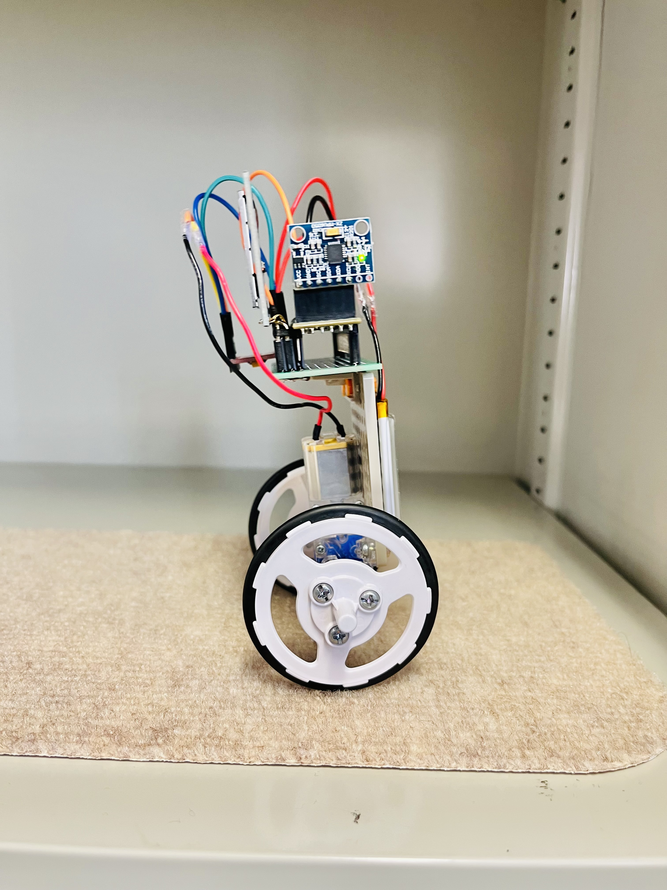

# robbit

**robbit**はFPGAを活用する扱いやすいtwo wheel self-balancing robotです。

これは、**CFU Proving Ground**というオープンソースの開発環境と**Cmod A7-35T** FPGAボードを使用して開発されています。  

**CFU Proving Ground**の詳細は
[archlab-science-tokyo/CFU-Proving-Ground](https://github.com/archlab-sciencetokyo/CFU-Proving-Ground)
をご参照ください。

- 推奨OS: **Ubuntu Linux**.
-  **Vivado 2024.1**.

<table>
    <tr>
        <td></td>
        <td></td>
</table>

-----

## 開発方法

robbitの開発を行う際は，./setting/manualフォルダ内にある**robbit_manual.pdf**と**robbit_system.pdf**を参考にする。

まずは，**robbit_manual.pdf**に記載されている手順に沿ってrobbitの組み立てと動作確認を行うと良い。

動作確認まで終えることができたら，**robbit_system.pdf**も参考にしながら，性能改善に取り組むことをお勧めする。

- [robbit_manual.pdf](./setting/manual/robbit_manual.pdf) : robbitの組み立て手順と開発手順が示されている
- [robbit_system.pdf](./setting/manual/robbit_system.pdf) : robbitに実装されている制御手法が示されている

## メモリーマップ

| addr   |  description                     |
| -----------| -----------------------------|
| 0x00000000 - 0x00007FFF | 32KiB Instruction Memory     |
| 0x10000000 - 0x10003FFF | 16KiB Data Memory            |
| 0x20000000 - 0x2000FFFF | 64KiB Video Memory    |
| 0x30000000 - 0x30000009 | acceleration，angular velocity |
| 0x30000010 | 100MHz Timer Clock |
| 0x30000040-0x3000044 | PWM signal, two buttons detection |
| 0x40000000 | performance counter control (0: reset, 1: start, 2: stop)|
| 0x40000004 | mcycle                  |
| 0x40000008 | mcycleh                 |
| 0x80000000 | tohost (for simulation) |

## バージョン履歴